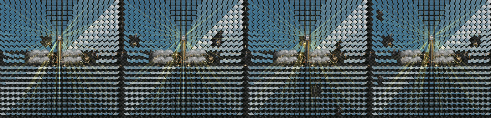

# Cheese's Concentrated Solar

This mod adds concentrated solar power to Factorio, in two components:

- **Heliostat Mirrors** - A mirror that rotates to send 100KW of solar power to the closest tower within their range of 33 tiles
- **Solar Towers** - Including the Solar Power Tower, which turns solar energy into up to 60MW of heat, and the Solar Laser Tower, which concentrates solar energy into up to 60MW of solar devastation

## Performance

Most work is done on building placement and deletion, then each group of a single tower and all it's mirrors are updated at once, making this quite performant. For UPS oriented megabases this is clearly not the way for the same reason as nuclear power; fluid.
